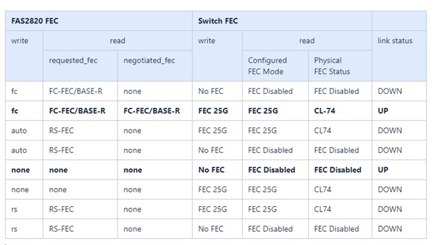

= Revise las consideraciones sobre el cableado y la configuración
:allow-uri-read: 
:icons: font
:imagesdir: ../media/

[role="lead"]
Antes de configurar el conmutador Broadcom BES-53248, revise las siguientes consideraciones.

== Asignaciones de switches de puertos de clúster

Puede utilizar la tabla de asignaciones de puertos de switch de clúster BES-53248 compatible con Broadcom como guía para configurar el clúster.

|===

| *Puertos del conmutador* | *Uso de puertos* 

 a| 
0-16
 a| 
Configuración base de nodos de puertos de clúster de 10 GbE

 a| 
17-48
 a| 
Nodos de puertos de clúster de 10 GbE, con licencias

 a| 
49-54
 a| 
40/100GbE nodos de puertos en clúster, con licencias, añadidos a la derecha a la izquierda

 a| 
55-56
 a| 
Puertos de enlace entre switches (ISL) de clúster de 100 GbE, configuración base

|===
Consulte https://hwu.netapp.com/Switch/Index["Hardware Universe"^] para obtener más información sobre los puertos de switch.

== Limitación de velocidad del grupo de puertos

* En los switches de clúster BES-53248, los puertos de 48 10 GbE (SFP28/SFP+) se combinan en 12 grupos de puertos de 4 de la siguiente manera: Puertos 1-4, 5-8, 9-12, 13-16, 17-20, 21-24, 25-28, 29-32, 33-36, 37-40, 41-44, y 45-48.
* La velocidad del puerto SFP28/SFP+ debe ser la misma (10 GbE o 25 GbE) en todos los puertos del grupo de 4 puertos.
* Si las velocidades de un grupo de 4 puertos son diferentes, los puertos del switch no funcionarán correctamente.

== Requisitos de FEC

* Para ver los puertos 25G con cables de cobre, consulte la siguiente tabla para obtener más detalles.
+
Si el lado del controlador es de `auto`, El lado del interruptor está ajustado a FEC 25G.

+
image::../media/FEC_copper_table.jpg[Puertos 25g con cables de cobre]

* Para los puertos 25G con cables de fibra óptica, consulte la siguiente tabla para obtener más información:
+

=== Implantación de Bootarg

Utilice el siguiente comando para establecer el FEC de puerto 25G en cualquiera de los dos `auto` o. `fc`, según sea necesario:

[listing]
----
systemshell -node <node> -command sudo sysctl dev.ice.<X>.requested_fec=<auto/fc>
----
* Cuando se establece en *`auto`*:
+
** La `auto` la configuración propaga la configuración al hardware inmediatamente y no es necesario reiniciarla.
** Si `bootarg.cpk_fec_fc_eXx already exists`, se elimina del almacenamiento de arranque.
** Después de un reinicio, el `auto` el ajuste permanece en su lugar desde `auto` Es el valor predeterminado de FEC.

* Cuando se establece en *`fc`*:
+
** La `FC-FEC` la configuración propaga la configuración al hardware inmediatamente y no es necesario reiniciarla.
** Un nuevo `bootarg.cpk_fec_fc_eXx` se crea con el valor establecido en true.
** Después de un reinicio, `FC-FEC` el ajuste permanece en su lugar para que el código de controlador lo utilice.

