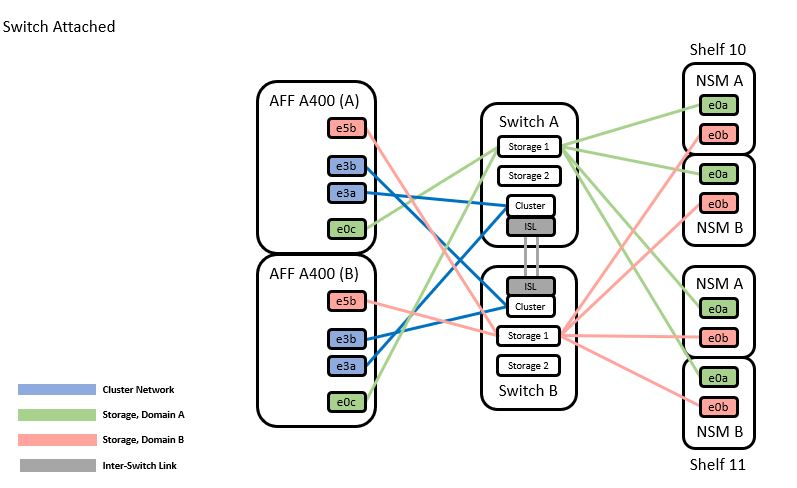

= Migre de una configuración sin switches con almacenamiento SAT reutilizando los switches de almacenamiento
:hardbreaks:
:allow-uri-read: 
:nofooter: 
:icons: font
:linkattrs: 
:imagesdir: ./media/

== Migre los switches de almacenamiento

Mediante la reutilización de los switches de almacenamiento, los switches de almacenamiento del par de alta disponibilidad 1 se convierten en los switches compartidos. *Diagrama de cableado para el interruptor*

.Pasos
. Compruebe que la configuración del almacenamiento de la pareja de alta disponibilidad 1 (y par de alta disponibilidad 2) sea correcta y esté libre de errores:
`system switch ethernet show`

[listing]
----
storage::*> system switch ethernet show
Switch                    Type                  Address          Model
------------------------- --------------------- ---------------- ----------
sh1
                          storage-network       172.17.227.5     C9336C

    Serial Number: FOC221206C2
     Is Monitored: true
           Reason: none
 Software Version: Cisco Nexus Operating System (NX-OS) Software, Version
                   9.3(5)
   Version Source: CDP
sh2
                        storage-network        172.17.227.6      C9336C
    Serial Number: FOC220443LZ
     Is Monitored: true
           Reason: None
 Software Version: Cisco Nexus Operating System (NX-OS) Software, Version
                   9.3(5)
   Version Source: CDP
2 entries were displayed.
storage::*>
----
. [[step2]]Compruebe que los puertos del nodo estén en buen estado y operativos:
`storage port show -port-type ENET`

[listing]
----
storage::*> storage port show -port-type ENET
                                   Speed                          VLAN
Node    Port    Type    Mode       (Gb/s)    State     Status       ID
------- ------- ------- ---------- --------- --------- --------- -----
node1
        e0c     ENET    storage          100 enabled   online       30
        e0d     ENET    storage          100 enabled   online       30
        e5a     ENET    storage          100 enabled   online       30
        e5b     ENET    storage          100 enabled   online       30

node2
        e0c     ENET    storage          100 enabled   online       30
        e0d     ENET    storage          100 enabled   online       30
        e5a     ENET    storage          100 enabled   online       30
        e5b     ENET    storage          100 enabled   online       30
----
. [[step3]]mueva Los cables de la ruta A del par de alta disponibilidad 1, NSM224, desde el switch de almacenamiento A hasta los puertos de almacenamiento compartidos NS224 para el par de alta disponibilidad 1, ruta A en el switch de almacenamiento A.
. Mueva el cable de la ruta A del par de alta disponibilidad 1, nodo A, al puerto de almacenamiento compartido para el par de alta disponibilidad 1, nodo A en el switch de almacenamiento A.
. Mueva el cable de la ruta A del par de alta disponibilidad 1, nodo B, al puerto de almacenamiento compartido para el par de alta disponibilidad 1, nodo B en el switch de almacenamiento A.
. Compruebe que el almacenamiento conectado al par de alta disponibilidad 1, el switch De almacenamiento A sea correcto:
`system health alert show -instance`

[listing]
----
storage::*> system health alert show -instance
There are no entries matching your query.
----
. [[step7]]sustituya el RCF de almacenamiento en el conmutador compartido A por el archivo RCF compartido. Consulte http://9336c_install_nx-os_software_and_reference_configuration_files_@rcfs@.html#install-the-rcf-on-a-cisco-nexus-9336c-fx2-shared-switch["Instale el RCF en un switch compartido Cisco Nexus 9336C-FX2"] para obtener más detalles.
. Compruebe que el almacenamiento conectado al par de alta disponibilidad 1, el switch de almacenamiento B sea correcto:
`system health alert show -instance`

[listing]
----
storage::*> system health alert show -instance
There are no entries matching your query.
----
. [[step9]]mueva los cables de la ruta B del par de alta disponibilidad 1 y NSM224 del conmutador de almacenamiento B a los puertos de almacenamiento compartidos NS224 para el par de alta disponibilidad 1, ruta B al conmutador de almacenamiento B.
. Mueva el cable desde el par de alta disponibilidad 1, nodo A, ruta B al puerto de almacenamiento compartido para el par de alta disponibilidad 1, nodo A, ruta B en el switch de almacenamiento B.
. Mueva el cable desde el par de alta disponibilidad 1, nodo B, ruta B al puerto de almacenamiento compartido para el par de alta disponibilidad 1, nodo B, ruta B en el switch de almacenamiento B.
. Compruebe que el almacenamiento conectado al par de alta disponibilidad 1, el switch de almacenamiento B sea correcto:
`system health alert show -instance`

[listing]
----
storage::*> system health alert show -instance
There are no entries matching your query.
----
. [[step13]]sustituya el archivo RCF de almacenamiento en el conmutador compartido B por el archivo RCF compartido. Consulte link:9336c_install_nx-os_software_and_reference_configuration_files_@rcfs@.html#install-the-rcf-on-a-cisco-nexus-9336c-fx2-shared-switch["Instale el RCF en un switch compartido Cisco Nexus 9336C-FX2"] para obtener más detalles.
. Compruebe que el almacenamiento conectado al par de alta disponibilidad 1, el switch de almacenamiento B sea correcto:
`system health alert show -instance`

[listing]
----
storage::*> system health alert show -instance
There are no entries matching your query.
----
. [[step15]]instale los ISL entre el switch compartido A y el conmutador compartido B:

[listing]
----
sh1# configure
Enter configuration commands, one per line. End with CNTL/Z.
sh1 (config)# interface e1/35-36
sh1 (config-if-range)# no lldp transmit
sh1 (config-if-range)# no lldp receive
sh1 (config-if-range)# switchport mode trunk
sh1 (config-if-range)# no spanning-tree bpduguard enable
sh1 (config-if-range)# channel-group 101 mode active
sh1 (config-if-range)# exit
sh1 (config)# interface port-channel 101
sh1 (config-if)# switchport mode trunk
sh1 (config-if)# spanning-tree port type network
sh1 (config-if)# exit
sh1 (config)# exit
----
. [[step16]]convierta el par de alta disponibilidad 1 de un clúster sin switches a un clúster con switches. Utilice las asignaciones de puertos del clúster definidas por el RCF compartido. Consulte link:9336c_install_nx-os_software_and_reference_configuration_files_@rcfs@.html["Instalar el software NX-OS y los archivos de configuración de referencia (RCF)"]para obtener más detalles.
. Compruebe que la configuración de red conmutada sea válida:
`network port show`

