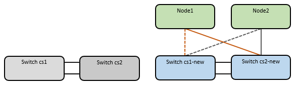

= Migre desde un switch de Cisco antiguo a un switch de clúster Cisco Nexus 9336C-FX2
:allow-uri-read: 
:icons: font
:imagesdir: ../media/

[role="lead"]
Puede realizar una migración no disruptiva de un switch de clúster anterior de Cisco a un switch de red de clúster Cisco Nexus 9336C-FX2.

== Revise los requisitos

Asegúrese de que:

* Algunos de los puertos de los switches Nexus 9336C-FX2 están configurados para funcionar a 10GbE o 40GbE GbE.
* Se ha planificado, migrado y documentado la conectividad 10GbE y 40GbE desde los nodos a los switches del clúster Nexus 9336C-FX2.
* El clúster está funcionando completamente (no debería haber errores en los registros o problemas similares).
* La personalización inicial de los switches Cisco Nexus 9336C-FX2 finaliza para que:
+
** Los switches 9336C-FX2 ejecutan la versión de software recomendada más reciente.
** Los archivos de configuración de referencia (RCF) se han aplicado a los conmutadores.
** La personalización de cualquier sitio, como DNS, NTP, SMTP, SNMP, Y SSH, se configuran en los nuevos switches.

* Tiene acceso a la tabla de compatibilidad del conmutador de https://mysupport.netapp.com/site/info/cisco-ethernet-switch["Switches Ethernet de Cisco"^] Para las versiones ONTAP, NX-OS y RCF admitidas.
* Ha revisado las guías de actualización y software adecuadas disponibles en el sitio web de Cisco para los procedimientos de actualización y degradación de switches de Cisco en https://www.cisco.com/c/en/us/support/switches/nexus-9000-series-switches/series.html["Compatibilidad con los switches Cisco Nexus serie 9000"^] página.

NOTE: Si está cambiando la velocidad de puerto de los puertos de los clústeres de e0a y e1a en sistemas AFF A800 o AFF C800, puede observar que se están recibiendo paquetes con formato incorrecto tras la conversión de velocidad. Consulte  https://mysupport.netapp.com/site/bugs-online/product/ONTAP/BURT/1570339["Error 1570339"^] Y el artículo de la base de conocimientos https://kb.netapp.com/onprem/ontap/hardware/CRC_errors_on_T6_ports_after_converting_from_40GbE_to_100GbE["Errores de CRC en puertos T6 después de convertir de 40GbE a 100GbE"^] para obtener orientación.

== Migrar los switches

.Acerca de los ejemplos
Los ejemplos de este procedimiento utilizan dos nodos. Estos nodos utilizan dos puertos de interconexión de clúster de 10 GbE en los puertos e0a y e0b. Consulte https://hwu.netapp.com/["Hardware Universe"^] para verificar los puertos de clúster correctos en sus plataformas.

NOTE: Los resultados del comando pueden variar en función de las diferentes versiones de ONTAP.

Los ejemplos de este procedimiento utilizan la nomenclatura de conmutador y nodo siguiente:

* Los nombres de los dos conmutadores Cisco existentes son *cs1* y *cs2*
* Los nuevos switches de clúster Nexus 9336C-FX2 son *cs1-new* y *cs2-new*.
* Los nombres de los nodos son *1* y *2*.
* Los nombres de LIF del clúster son *1_clus1* y *1_clus2* para el nodo 1, y *2_clus1* y *2_clus2* para el nodo 2.
* El símbolo *cluster1:*>* indica el nombre del clúster.

Durante este procedimiento, consulte el siguiente ejemplo:

image::../media/Initial_setup.png[Configuración inicial del switch]

.Acerca de esta tarea
El procedimiento requiere el uso de tanto comandos de la ONTAP como de https://www.cisco.com/c/en/us/support/switches/nexus-9000-series-switches/series.html["Switches de la serie Nexus 9000"^] Comandos; los comandos de ONTAP se utilizan, a menos que se indique lo contrario.

Durante este procedimiento no se necesita ningún enlace entre switches (ISL) operativo. Esto se debe a que los cambios en la versión de RCF pueden afectar temporalmente a la conectividad ISL. Para garantizar operaciones de clúster no disruptivas, el siguiente procedimiento migra todas las LIF del clúster al switch de partner operativo mientras realiza los pasos del switch de destino.

=== Paso 1: Preparación para la migración

. Si se habilita AutoSupport en este clúster, elimine la creación automática de casos invocando un mensaje de AutoSupport: `system node autosupport invoke -node * -type all -message MAINT=xh`
+
donde _x_ es la duración de la ventana de mantenimiento en horas.

+

NOTE: El mensaje de AutoSupport notifica al soporte técnico de esta tarea de mantenimiento para que la creación automática de casos se suprima durante la ventana de mantenimiento.

. Cambie el nivel de privilegio a avanzado, introduciendo *y* cuando se le solicite continuar:
+
`set -privilege advanced`

+
Aparece el mensaje avanzado (*>).

=== Paso 2: Configure los puertos y el cableado

. En los switches nuevos, confirme que el ISL se ha cableado y está en buen estado entre los switches cs1-new y cs2-new:
+
`show port-channel summary`

+
.Muestra el ejemplo
[%collapsible]
====
[listing, subs="+quotes"]
----
cs1-new# *show port-channel summary*
Flags:  D - Down        P - Up in port-channel (members)
        I - Individual  H - Hot-standby (LACP only)
        s - Suspended   r - Module-removed
        b - BFD Session Wait
        S - Switched    R - Routed
        U - Up (port-channel)
        p - Up in delay-lacp mode (member)
        M - Not in use. Min-links not met
--------------------------------------------------------------------------------
Group Port-       Type     Protocol  Member Ports
      Channel
--------------------------------------------------------------------------------
1     Po1(SU)     Eth      LACP      Eth1/35(P)   Eth1/36(P)

cs2-new# *show port-channel summary*
Flags:  D - Down        P - Up in port-channel (members)
        I - Individual  H - Hot-standby (LACP only)
        s - Suspended   r - Module-removed
        b - BFD Session Wait
        S - Switched    R - Routed
        U - Up (port-channel)
        p - Up in delay-lacp mode (member)
        M - Not in use. Min-links not met
--------------------------------------------------------------------------------
Group Port-       Type     Protocol  Member Ports
      Channel
--------------------------------------------------------------------------------
1     Po1(SU)     Eth      LACP      Eth1/35(P)   Eth1/36(P)
----
====
. Muestre los puertos del clúster en cada nodo que están conectados a los switches de clúster existentes:
+
`network device-discovery show`

+
.Muestra el ejemplo
[%collapsible]
====
[listing, subs="+quotes"]
----
cluster1::*> *network device-discovery show -protocol cdp*
Node/       Local  Discovered
Protocol    Port   Device (LLDP: ChassisID)  Interface         Platform
----------- ------ ------------------------- ----------------  ----------------
node1      /cdp
            e0a    cs1                       Ethernet1/1        N5K-C5596UP
            e0b    cs2                       Ethernet1/2        N5K-C5596UP
node2      /cdp
            e0a    cs1                       Ethernet1/1        N5K-C5596UP
            e0b    cs2                       Ethernet1/2        N5K-C5596UP
----
====
. Determinar el estado administrativo u operativo de cada puerto de clúster.
+
.. Compruebe que todos los puertos del clúster tengan el estado correcto:
+
`network port show -ipspace Cluster`

+
.Muestra el ejemplo
[%collapsible]
====
[listing, subs="+quotes"]
----
cluster1::*> *network port show -ipspace Cluster*

Node: node1
                                                                       Ignore
                                                  Speed(Mbps) Health   Health
Port      IPspace      Broadcast Domain Link MTU  Admin/Oper  Status   Status
--------- ------------ ---------------- ---- ---- ----------- -------- ------
e0a       Cluster      Cluster          up   9000  auto/10000 healthy  false
e0b       Cluster      Cluster          up   9000  auto/10000 healthy  false

Node: node2
                                                                       Ignore
                                                  Speed(Mbps) Health   Health
Port      IPspace      Broadcast Domain Link MTU  Admin/Oper  Status   Status
--------- ------------ ---------------- ---- ---- ----------- -------- ------
e0a       Cluster      Cluster          up   9000  auto/10000 healthy  false
e0b       Cluster      Cluster          up   9000  auto/10000 healthy  false
----
====
.. Compruebe que todas las interfaces del clúster (LIF) están en sus puertos de inicio:
+
`network interface show -vserver Cluster`

+
.Muestra el ejemplo
[%collapsible]
====
[listing, subs="+quotes"]
----
cluster1::*> *network interface show -vserver Cluster*

            Logical      Status     Network            Current     Current Is
Vserver     Interface    Admin/Oper Address/Mask       Node        Port    Home
----------- -----------  ---------- ------------------ ----------- ------- ----
Cluster
            node1_clus1  up/up      169.254.209.69/16  node1       e0a     true
            node1_clus2  up/up      169.254.49.125/16  node1       e0b     true
            node2_clus1  up/up      169.254.47.194/16  node2       e0a     true
            node2_clus2  up/up      169.254.19.183/16  node2       e0b     true
----
====
.. Compruebe que el clúster muestra información de ambos switches de clúster:
+
`system cluster-switch show -is-monitoring-enabled-operational true`

+
.Muestra el ejemplo
[%collapsible]
====
[listing, subs="+quotes"]
----
cluster1::*> *system cluster-switch show -is-monitoring-enabled-operational true*
Switch                      Type               Address          Model
--------------------------- ------------------ ---------------- ---------------
cs1                         cluster-network    10.233.205.92    N5K-C5596UP
      Serial Number: FOXXXXXXXGS
       Is Monitored: true
             Reason: None
   Software Version: Cisco Nexus Operating System (NX-OS) Software, Version
                     9.3(4)
     Version Source: CDP

cs2                         cluster-network     10.233.205.93   N5K-C5596UP
      Serial Number: FOXXXXXXXGD
       Is Monitored: true
             Reason: None
   Software Version: Cisco Nexus Operating System (NX-OS) Software, Version
                     9.3(4)
     Version Source: CDP
----
====

. Deshabilite la reversión automática en las LIF del clúster.
+
.Muestra el ejemplo
[%collapsible]
====
[listing, subs="+quotes"]
----
cluster1::*> *network interface modify -vserver Cluster -lif * -auto-revert false*
----
====
. En el switch del clúster cs2, apague los puertos conectados a los puertos del clúster de los nodos:
+
.Muestra el ejemplo
[%collapsible]
====
[listing, subs="+quotes"]
----
cs2(config)# *interface eth1/1-1/2*
cs2(config-if-range)# *shutdown*
----
====
. Comprobar que las LIF del clúster han migrado a los puertos alojados en el switch del clúster cs1. Esto puede tardar unos segundos.
+
`network interface show -vserver Cluster`

+
.Muestra el ejemplo
[%collapsible]
====
[listing, subs="+quotes"]
----
cluster1::*> *network interface show -vserver Cluster*
            Logical       Status     Network            Current    Current Is
Vserver     Interface     Admin/Oper Address/Mask       Node       Port    Home
----------- ------------- ---------- ------------------ ---------- ------- ----
Cluster
            node1_clus1   up/up      169.254.3.4/16     node1      e0a     true
            node1_clus2   up/up      169.254.3.5/16     node1      e0a     false
            node2_clus1   up/up      169.254.3.8/16     node2      e0a     true
            node2_clus2   up/up      169.254.3.9/16     node2      e0a     false
----
====
. Compruebe que el clúster esté en buen estado:
+
`cluster show`

+
.Muestra el ejemplo
[%collapsible]
====
[listing, subs="+quotes"]
----
cluster1::*> cluster show
Node       Health  Eligibility   Epsilon
---------- ------- ------------- -------
node1      true    true          false
node2      true    true          false
----
====
. Mueva todos los cables de conexión de nodos del clúster del switch CS2 antiguo al nuevo switch de CS2 nuevos.
+
* Cables de conexión de nodo de clúster movidos al switch CS2-new*

+
image::../media/new_switch_cs1.png[Los cables de conexión de nodo de clúster se mueven al switch CS2 nuevo]

. Confirme el estado de las conexiones de red movidas a cs2-new:
+
`network port show -ipspace Cluster`

+
.Muestra el ejemplo
[%collapsible]
====
[listing, subs="+quotes"]
----
cluster1::*> *network port show -ipspace Cluster*

Node: node1
                                                                       Ignore
                                                  Speed(Mbps) Health   Health
Port      IPspace      Broadcast Domain Link MTU  Admin/Oper  Status   Status
--------- ------------ ---------------- ---- ---- ----------- -------- ------
e0a       Cluster      Cluster          up   9000  auto/10000 healthy  false
e0b       Cluster      Cluster          up   9000  auto/10000 healthy  false

Node: node2
                                                                       Ignore
                                                  Speed(Mbps) Health   Health
Port      IPspace      Broadcast Domain Link MTU  Admin/Oper  Status   Status
--------- ------------ ---------------- ---- ---- ----------- -------- ------
e0a       Cluster      Cluster          up   9000  auto/10000 healthy  false
e0b       Cluster      Cluster          up   9000  auto/10000 healthy  false
----
====
+
Todos los puertos del clúster que se movieron deben estar en funcionamiento.

. Compruebe la información de cercanía en los puertos de clúster:
+
`network device-discovery show -protocol cdp`

+
.Muestra el ejemplo
[%collapsible]
====
[listing, subs="+quotes"]
----
cluster1::*> *network device-discovery show -protocol cdp*

Node/       Local  Discovered
Protocol    Port   Device (LLDP: ChassisID)  Interface      Platform
----------- ------ ------------------------- -------------  --------------
node1      /cdp
            e0a    cs1                       Ethernet1/1    N5K-C5596UP
            e0b    cs2-new                   Ethernet1/1/1  N9K-C9336C-FX2

node2      /cdp
            e0a    cs1                       Ethernet1/2    N5K-C5596UP
            e0b    cs2-new                   Ethernet1/1/2  N9K-C9336C-FX2
----
====
+
Compruebe que los puertos del clúster movidos ven al conmutador cs2-new como vecino.

. Confirme las conexiones del puerto del conmutador desde la perspectiva del conmutador cs2-new:
+
[listing, subs="+quotes"]
----
cs2-new# *show interface brief*
cs2-new# *show cdp neighbors*
----
. En el switch de clúster cs1, apague los puertos conectados a los puertos del clúster de los nodos. En el ejemplo siguiente se utiliza el resultado del ejemplo de interfaz del paso 7.
+
[listing, subs="+quotes"]
----
cs1(config)# *interface eth1/1-1/2*
cs1(config-if-range)# *shutdown*
----
+
Todos los LIF del clúster se moverán al switch cs2-new.

. Compruebe que las LIF del clúster han migrado a los puertos alojados en el switch cs2-new. Esto puede tardar unos segundos:
+
`network interface show -vserver Cluster`

+
.Muestra el ejemplo
[%collapsible]
====
[listing, subs="+quotes"]
----
cluster1::*> *network interface show -vserver Cluster*
            Logical      Status     Network            Current     Current Is
Vserver     Interfac     Admin/Oper Address/Mask       Node        Port    Home
----------- ------------ ---------- ------------------ ----------- ------- ----
Cluster
            node1_clus1  up/up      169.254.3.4/16     node1       e0b     false
            node1_clus2  up/up      169.254.3.5/16     node1       e0b     true
            node2_clus1  up/up      169.254.3.8/16     node2       e0b     false
            node2_clus2  up/up      169.254.3.9/16     node2       e0b     true
----
====
. Compruebe que el clúster esté en buen estado:
+
`cluster show`

+
.Muestra el ejemplo
[%collapsible]
====
[listing, subs="+quotes"]
----
cluster1::*> *cluster show*
Node       Health  Eligibility   Epsilon
---------- ------- ------------- -------
node1      true    true          false
node2      true    true          false
----
====
. Mueva los cables de conexión de nodo de clúster de CS1 al nuevo switch de CS1 nuevos.
+
* Cables de conexión de nodo de clúster movidos al switch CS1-new*

+

. Confirme el estado de las conexiones de red movidas a cs1-new:
+
`network port show -ipspace Cluster`

+
.Muestra el ejemplo
[%collapsible]
====
[listing, subs="+quotes"]
----
cluster1::*> *network port show -ipspace Cluster*

Node: node1
                                                                       Ignore
                                                  Speed(Mbps) Health   Health
Port      IPspace      Broadcast Domain Link MTU  Admin/Oper  Status   Status
--------- ------------ ---------------- ---- ---- ----------- -------- ------
e0a       Cluster      Cluster          up   9000  auto/10000 healthy  false
e0b       Cluster      Cluster          up   9000  auto/10000 healthy  false

Node: node2
                                                                       Ignore
                                                  Speed(Mbps) Health   Health
Port      IPspace      Broadcast Domain Link MTU  Admin/Oper  Status   Status
--------- ------------ ---------------- ---- ---- ----------- -------- ------
e0a       Cluster      Cluster          up   9000  auto/10000 healthy  false
e0b       Cluster      Cluster          up   9000  auto/10000 healthy  false
----
====
+
Todos los puertos del clúster que se movieron deben estar en funcionamiento.

. Compruebe la información de cercanía en los puertos de clúster:
+
`network device-discovery show`

+
.Muestra el ejemplo
[%collapsible]
====
[listing, subs="+quotes"]
----
cluster1::*> *network device-discovery show -protocol cdp*
Node/       Local  Discovered
Protocol    Port   Device (LLDP: ChassisID)  Interface       Platform
----------- ------ ------------------------- --------------  --------------
node1      /cdp
            e0a    cs1-new                   Ethernet1/1/1   N9K-C9336C-FX2
            e0b    cs2-new                   Ethernet1/1/2   N9K-C9336C-FX2

node2      /cdp
            e0a    cs1-new                   Ethernet1/1/1   N9K-C9336C-FX2
            e0b    cs2-new                   Ethernet1/1/2   N9K-C9336C-FX2
----
====
+
Compruebe que los puertos del clúster movidos ven al switch cs1-new como vecino.

. Confirme las conexiones del puerto del conmutador desde la perspectiva del conmutador cs1-new:
+
.Muestra el ejemplo
[%collapsible]
====
[listing, subs="+quotes"]
----
cs1-new# *show interface brief*
cs1-new# *show cdp neighbors*
----
====
. Compruebe que el ISL entre cs1-new y cs2-new siga operativo:
+
`show port-channel summary`

+
.Muestra el ejemplo
[%collapsible]
====
[listing, subs="+quotes"]
----
cs1-new# *show port-channel summary*
Flags:  D - Down        P - Up in port-channel (members)
        I - Individual  H - Hot-standby (LACP only)
        s - Suspended   r - Module-removed
        b - BFD Session Wait
        S - Switched    R - Routed
        U - Up (port-channel)
        p - Up in delay-lacp mode (member)
        M - Not in use. Min-links not met
--------------------------------------------------------------------------------
Group Port-       Type     Protocol  Member Ports
      Channel
--------------------------------------------------------------------------------
1     Po1(SU)     Eth      LACP      Eth1/35(P)   Eth1/36(P)

cs2-new# *show port-channel summary*
Flags:  D - Down        P - Up in port-channel (members)
        I - Individual  H - Hot-standby (LACP only)
        s - Suspended   r - Module-removed
        b - BFD Session Wait
        S - Switched    R - Routed
        U - Up (port-channel)
        p - Up in delay-lacp mode (member)
        M - Not in use. Min-links not met
--------------------------------------------------------------------------------
Group Port-       Type     Protocol  Member Ports
      Channel
--------------------------------------------------------------------------------
1     Po1(SU)     Eth      LACP      Eth1/35(P)   Eth1/36(P)
----
====

=== Paso 3: Verificar la configuración

. Habilite la reversión automática en las LIF del clúster.
+
.Muestra el ejemplo
[%collapsible]
====
[listing, subs="+quotes"]
----
cluster1::*> *network interface modify -vserver Cluster -lif * -auto-revert true*
----
====
. Compruebe que las LIF del clúster han vuelto a sus puertos raíz (esto puede tardar un minuto):
+
`network interface show -vserver Cluster`

+
Si los LIF del clúster no han cambiado a su puerto de inicio, los revierte manualmente:

+
`network interface revert -vserver Cluster -lif *`

. Compruebe que el clúster esté en buen estado:
+
`cluster show`

. Compruebe la conectividad de las interfaces del clúster remoto:

[role="tabbed-block"]
====
.ONTAP 9.9.1 y versiones posteriores
--
Puede utilizar el `network interface check cluster-connectivity` comando para iniciar una comprobación de accesibilidad de la conectividad del clúster y, a continuación, muestre los detalles:

`network interface check cluster-connectivity start` y.. `network interface check cluster-connectivity show`

[listing, subs="+quotes"]
----
cluster1::*> *network interface check cluster-connectivity start*
----
*NOTA:* Espere varios segundos antes de ejecutar el comando show para mostrar los detalles.

[listing, subs="+quotes"]
----
cluster1::*> *network interface check cluster-connectivity show*
                                  Source          Destination       Packet
Node   Date                       LIF             LIF               Loss
------ -------------------------- --------------- ----------------- -----------
node1
       3/5/2022 19:21:18 -06:00   node1_clus2      node2_clus1      none
       3/5/2022 19:21:20 -06:00   node1_clus2      node2_clus2      none

node2
       3/5/2022 19:21:18 -06:00   node2_clus2      node1_clus1      none
       3/5/2022 19:21:20 -06:00   node2_clus2      node1_clus2      none
----
--
.Todos los lanzamientos de ONTAP
--
En todas las versiones de ONTAP, también se puede utilizar el `cluster ping-cluster -node <name>` comando para comprobar la conectividad:

`cluster ping-cluster -node <name>`

[listing, subs="+quotes"]
----
cluster1::*> *cluster ping-cluster -node node2*
Host is node2
Getting addresses from network interface table...
Cluster node1_clus1 169.254.209.69 node1     e0a
Cluster node1_clus2 169.254.49.125 node1     e0b
Cluster node2_clus1 169.254.47.194 node2     e0a
Cluster node2_clus2 169.254.19.183 node2     e0b
Local = 169.254.47.194 169.254.19.183
Remote = 169.254.209.69 169.254.49.125
Cluster Vserver Id = 4294967293
Ping status:
....
Basic connectivity succeeds on 4 path(s)
Basic connectivity fails on 0 path(s)
................
Detected 9000 byte MTU on 4 path(s):
    Local 169.254.19.183 to Remote 169.254.209.69
    Local 169.254.19.183 to Remote 169.254.49.125
    Local 169.254.47.194 to Remote 169.254.209.69
    Local 169.254.47.194 to Remote 169.254.49.125
Larger than PMTU communication succeeds on 4 path(s)
RPC status:
2 paths up, 0 paths down (tcp check)
2 paths up, 0 paths down (udp check)
----
--
====
. [[step5]]Habilite la función de recopilación de registros del monitor de estado del switch Ethernet para recopilar archivos de registro relacionados con el switch.

[role="tabbed-block"]
====
.ONTAP 9.8 y posteriores
--
Habilite la función de recogida de registros de control de estado del switch Ethernet para recopilar archivos de registro relacionados con el switch mediante los dos comandos siguientes: `system switch ethernet log setup-password` y.. `system switch ethernet log enable-collection`

*NOTA:* necesitará la contraseña para el usuario *admin* en los conmutadores.

Introduzca: `system switch ethernet log setup-password`

[listing, subs="+quotes"]
----
cluster1::*> *system switch ethernet log setup-password*
Enter the switch name: <return>
The switch name entered is not recognized.
Choose from the following list:
cs1-new
cs2-new

cluster1::*> *system switch ethernet log setup-password*

Enter the switch name: *cs1-new*
RSA key fingerprint is e5:8b:c6:dc:e2:18:18:09:36:63:d9:63:dd:03:d9:cc
Do you want to continue? {y|n}::[n] *y*

Enter the password: <password of switch's admin user>
Enter the password again: <password of switch's admin user>

cluster1::*> *system switch ethernet log setup-password*

Enter the switch name: *cs2-new*
RSA key fingerprint is 57:49:86:a1:b9:80:6a:61:9a:86:8e:3c:e3:b7:1f:b1
Do you want to continue? {y|n}:: [n] *y*

Enter the password: <password of switch's admin user>
Enter the password again: <password of switch's admin user>
----
Seguido de: `system switch ethernet log enable-collection`

[listing, subs="+quotes"]
----
cluster1::*> *system  switch ethernet log enable-collection*

Do you want to enable cluster log collection for all nodes in the cluster?
{y|n}: [n] *y*

Enabling cluster switch log collection.

cluster1::*>
----
*NOTA:* Si alguno de estos comandos devuelve un error, póngase en contacto con el soporte de NetApp.

--
.ONTAP lanza versiones 9.5P16, 9.6P12 y 9.7P10 y versiones posteriores de parches
--
Habilite la función de recogida de registros de control de estado del switch Ethernet para recopilar archivos de registro relacionados con el switch mediante los comandos: `system cluster-switch log setup-password` y.. `system cluster-switch log enable-collection`

*NOTA:* necesitará la contraseña para el usuario *admin* en los conmutadores.

Introduzca: `system cluster-switch log setup-password`

[listing, subs="+quotes"]
----
cluster1::*> *system cluster-switch log setup-password*
Enter the switch name: <return>
The switch name entered is not recognized.
Choose from the following list:
cs1-new
cs2-new

cluster1::*> *system cluster-switch log setup-password*

Enter the switch name: *cs1-new*
RSA key fingerprint is e5:8b:c6:dc:e2:18:18:09:36:63:d9:63:dd:03:d9:cc
Do you want to continue? {y|n}::[n] *y*

Enter the password: <password of switch's admin user>
Enter the password again: <password of switch's admin user>

cluster1::*> *system cluster-switch log setup-password*

Enter the switch name: *cs2-new*
RSA key fingerprint is 57:49:86:a1:b9:80:6a:61:9a:86:8e:3c:e3:b7:1f:b1
Do you want to continue? {y|n}:: [n] *y*

Enter the password: <password of switch's admin user>
Enter the password again: <password of switch's admin user>
----
Seguido de: `system cluster-switch log enable-collection`

[listing, subs="+quotes"]
----
cluster1::*> *system cluster-switch log enable-collection*

Do you want to enable cluster log collection for all nodes in the cluster?
{y|n}: [n] *y*

Enabling cluster switch log collection.

cluster1::*>
----
*NOTA:* Si alguno de estos comandos devuelve un error, póngase en contacto con el soporte de NetApp.

--
====
. [[step6]]Si suprimió la creación automática de casos, vuelva a activarla llamando a un mensaje AutoSupport: `system node autosupport invoke -node * -type all -message MAINT=END`

