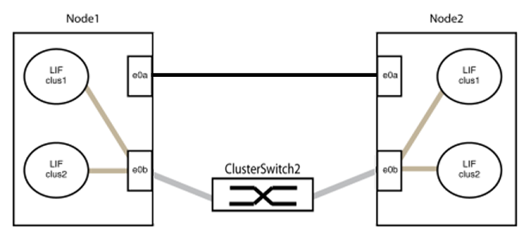

= Migre de un clúster con switches a uno sin switches con switches de clúster NVIDIA SN2100
:allow-uri-read: 
:icons: font
:imagesdir: ../media/

[role="lead"]
Puede migrar desde un clúster con una red de clúster conmutada a uno donde dos nodos están conectados directamente para ONTAP 9.3 y versiones posteriores.

== Revise los requisitos

.Directrices
Revise las siguientes directrices:

* La migración a una configuración de clúster de dos nodos sin switch es una operación no disruptiva. La mayoría de los sistemas tienen dos puertos de interconexión de clúster dedicados en cada nodo, pero también puede usar este procedimiento para sistemas con un número mayor de puertos de interconexión de clúster dedicados en cada nodo, como cuatro, seis u ocho.
* No se puede usar la función de interconexión de clúster sin switches con más de dos nodos.
* Si tiene un clúster de dos nodos existente que utiliza switches de interconexión de clúster y ejecuta ONTAP 9.3 o una versión posterior, puede reemplazar los switches por conexiones directas de vuelta a atrás entre los nodos.

.Lo que necesitará
* Un clúster en buen estado que consta de dos nodos conectados por switches de clúster. Los nodos deben ejecutar la misma versión de ONTAP.
* Cada nodo con el número requerido de puertos de clúster dedicados, que proporcionan conexiones redundantes de interconexión de clúster para admitir la configuración de su sistema. Por ejemplo, hay dos puertos redundantes para un sistema con dos puertos de Cluster Interconnect dedicados en cada nodo.

== Migrar los switches

.Acerca de esta tarea
En el siguiente procedimiento, se quitan los switches de clúster de dos nodos y se reemplaza cada conexión al switch por una conexión directa al nodo compañero.

image::../media/tnsc_clusterswitches_and_direct_connections.PNG[Los switches del clúster se reemplazaron por conexiones directas]

.Acerca de los ejemplos
Los ejemplos del siguiente procedimiento muestran nodos que utilizan «e0a» y «e0b» como puertos del clúster. Sus nodos pueden usar distintos puertos de clúster según varían según el sistema.

=== Paso 1: Preparación para la migración

. Cambie el nivel de privilegio a Advanced, introduzca `y` cuando se le solicite continuar:
+
`set -privilege advanced`

+
El aviso avanzado `*>` aparece.

. ONTAP 9.3 y versiones posteriores admiten la detección automática de clústeres sin switch, que está habilitado de forma predeterminada.
+
Puede verificar que la detección de clústeres sin switch esté habilitada mediante el comando de privilegio avanzado:

+
`network options detect-switchless-cluster show`

+
.Muestra el ejemplo
[%collapsible]
====
El siguiente resultado de ejemplo muestra si la opción está habilitada.

[listing]
----
cluster::*> network options detect-switchless-cluster show
   (network options detect-switchless-cluster show)
Enable Switchless Cluster Detection: true
----
====
+
Si la opción "Activar detección de clústeres sin switch" es `false`Póngase en contacto con el soporte de NetApp.

. Si se habilita AutoSupport en este clúster, elimine la creación automática de casos invocando un mensaje de AutoSupport:
+
`system node autosupport invoke -node * -type all -message MAINT=<number_of_hours>h`

+
donde `h` es la duración del plazo de mantenimiento en horas. El mensaje notifica al soporte técnico de esta tarea de mantenimiento para que estos puedan impedir la creación automática de casos durante la ventana de mantenimiento.

+
En el ejemplo siguiente, el comando suprime la creación automática de casos durante dos horas:

+
.Muestra el ejemplo
[%collapsible]
====
[listing]
----
cluster::*> system node autosupport invoke -node * -type all -message MAINT=2h
----
====

=== Paso 2: Configure los puertos y el cableado

. Organice los puertos del clúster en cada switch en grupos de modo que los puertos del clúster en group1 vayan a Cluster switch1 y los puertos del cluster en group2 vayan a cluster switch2. Estos grupos son necesarios más adelante en el procedimiento.
. Identificar los puertos del clúster y verificar el estado y el estado del enlace:
+
`network port show -ipspace Cluster`

+
En el siguiente ejemplo, en el caso de nodos con puertos de clúster "e0a" y "e0b", un grupo se identifica como “1:e0a” y “2:e0a” y el otro grupo como “1:e0b” y “2:e0b”. Sus nodos pueden usar puertos de clúster diferentes porque varían según el sistema.

+
image::../media/tnsc_clusterswitch_connections.PNG[Conexiones del switch de clúster entre los nodos 1 y 2]

+
Compruebe que los puertos tienen un valor de `up` Para la columna “Link” y un valor de `healthy` Para la columna "Estado de salud".

+
.Muestra el ejemplo
[%collapsible]
====
[listing]
----
cluster::> network port show -ipspace Cluster
Node: node1
                                                                 Ignore
                                             Speed(Mbps) Health  Health
Port  IPspace   Broadcast Domain Link  MTU   Admin/Oper	 Status  Status
----- --------- ---------------- ----- ----- ----------- ------- -------
e0a   Cluster   Cluster          up    9000  auto/10000  healthy false
e0b   Cluster   Cluster          up    9000  auto/10000  healthy false

Node: node2
                                                                 Ignore
                                             Speed(Mbps) Health  Health
Port  IPspace   Broadcast Domain Link  MTU   Admin/Oper	 Status  Status
----- --------- ---------------- ----- ----- ----------- ------- -------
e0a   Cluster   Cluster          up    9000  auto/10000  healthy false
e0b   Cluster   Cluster          up    9000  auto/10000  healthy false
4 entries were displayed.
----
====
. Confirmar que todas las LIF de clúster están en sus puertos raíz.
+
Compruebe que la columna "es-home" es `true` Para cada LIF del clúster:

+
`network interface show -vserver Cluster -fields is-home`

+
.Muestra el ejemplo
[%collapsible]
====
[listing]
----
cluster::*> net int show -vserver Cluster -fields is-home
(network interface show)
vserver  lif          is-home
-------- ------------ --------
Cluster  node1_clus1  true
Cluster  node1_clus2  true
Cluster  node2_clus1  true
Cluster  node2_clus2  true
4 entries were displayed.
----
====
+
Si hay LIF de clúster que no estén en sus puertos raíz, revierte estos LIF a sus puertos principales:

+
`network interface revert -vserver Cluster -lif *`

. Deshabilite la reversión automática para las LIF del clúster:
+
`network interface modify -vserver Cluster -lif * -auto-revert false`

. Compruebe que todos los puertos enumerados en el paso anterior están conectados a un conmutador de red:
+
`network device-discovery show -port _cluster_port_`

+
La columna “dispositivo detectado” debe ser el nombre del conmutador de clúster al que está conectado el puerto.

+
.Muestra el ejemplo
[%collapsible]
====
En el siguiente ejemplo se muestra que los puertos de clúster «e0a» y «e0b» están conectados correctamente a los switches del clúster «cs1» y «cs2».

[listing]
----
cluster::> network device-discovery show -port e0a|e0b
  (network device-discovery show)
Node/     Local  Discovered
Protocol  Port   Device (LLDP: ChassisID)  Interface  Platform
--------- ------ ------------------------- ---------- ----------
node1/cdp
          e0a    cs1                       0/11       BES-53248
          e0b    cs2                       0/12       BES-53248
node2/cdp
          e0a    cs1                       0/9        BES-53248
          e0b    cs2                       0/9        BES-53248
4 entries were displayed.
----
====
. Compruebe la conectividad de las interfaces del clúster remoto:

[role="tabbed-block"]
====
.ONTAP 9.9.1 y versiones posteriores
--
Puede utilizar el `network interface check cluster-connectivity` comando para iniciar una comprobación de accesibilidad de la conectividad del clúster y, a continuación, muestre los detalles:

`network interface check cluster-connectivity start` y.. `network interface check cluster-connectivity show`

[listing, subs="+quotes"]
----
cluster1::*> *network interface check cluster-connectivity start*
----
*NOTA:* Espere varios segundos antes de ejecutar el `show` comando para mostrar los detalles.

[listing, subs="+quotes"]
----
cluster1::*> *network interface check cluster-connectivity show*
                                  Source           Destination      Packet
Node   Date                       LIF              LIF              Loss
------ -------------------------- ---------------- ---------------- -----------
node1
       3/5/2022 19:21:18 -06:00   node1_clus2      node2-clus1      none
       3/5/2022 19:21:20 -06:00   node1_clus2      node2_clus2      none
node2
       3/5/2022 19:21:18 -06:00   node2_clus2      node1_clus1      none
       3/5/2022 19:21:20 -06:00   node2_clus2      node1_clus2      none
----
--
.Todos los lanzamientos de ONTAP
--
En todas las versiones de ONTAP, también se puede utilizar el `cluster ping-cluster -node <name>` comando para comprobar la conectividad:

`cluster ping-cluster -node <name>`

[listing, subs="+quotes"]
----
cluster1::*> *cluster ping-cluster -node local*
Host is node2
Getting addresses from network interface table...
Cluster node1_clus1 169.254.209.69 node1 e0a
Cluster node1_clus2 169.254.49.125 node1 e0b
Cluster node2_clus1 169.254.47.194 node2 e0a
Cluster node2_clus2 169.254.19.183 node2 e0b
Local = 169.254.47.194 169.254.19.183
Remote = 169.254.209.69 169.254.49.125
Cluster Vserver Id = 4294967293
Ping status:

Basic connectivity succeeds on 4 path(s)
Basic connectivity fails on 0 path(s)

Detected 9000 byte MTU on 4 path(s):
Local 169.254.47.194 to Remote 169.254.209.69
Local 169.254.47.194 to Remote 169.254.49.125
Local 169.254.19.183 to Remote 169.254.209.69
Local 169.254.19.183 to Remote 169.254.49.125
Larger than PMTU communication succeeds on 4 path(s)
RPC status:
2 paths up, 0 paths down (tcp check)
2 paths up, 0 paths down (udp check)
----
--
====
. [[step7]] Verifique que el clúster esté en buen estado:
+
`cluster ring show`

+
Todas las unidades deben ser maestra o secundaria.

. Configure la configuración sin switches para los puertos del grupo 1.
+

IMPORTANT: Para evitar posibles problemas de red, debe desconectar los puertos del grupo 1 y volver a conectarlos lo antes posible, por ejemplo, *en menos de 20 segundos*.

+
.. Desconecte todos los cables de los puertos del grupo 1 al mismo tiempo.
+
En el ejemplo siguiente, los cables se desconectan del puerto "e0a" en cada nodo, y el tráfico del clúster continúa a través del switch y el puerto "e0b" en cada nodo:

+
image::../media/tnsc_clusterswitch1_disconnected.PNG[ClusterSwitch1 desconectado]

.. Conecte los puertos en group1 de vuelta a espalda.
+
En el siguiente ejemplo, "e0a" en el nodo 1 está conectado a "e0a" en el nodo 2:

+

. La opción de red de clúster sin switch desde la transición `false` para `true`. Esto puede tardar hasta 45 segundos. Confirme que la opción sin switches está establecida en `true`:
+
`network options switchless-cluster show`

+
En el siguiente ejemplo se muestra que el clúster sin switch está habilitado:

+
[listing]
----
cluster::*> network options switchless-cluster show
Enable Switchless Cluster: true
----
. Compruebe la conectividad de las interfaces del clúster remoto:

[role="tabbed-block"]
====
.ONTAP 9.9.1 y versiones posteriores
--
Puede utilizar el `network interface check cluster-connectivity` comando para iniciar una comprobación de accesibilidad de la conectividad del clúster y, a continuación, muestre los detalles:

`network interface check cluster-connectivity start` y.. `network interface check cluster-connectivity show`

[listing, subs="+quotes"]
----
cluster1::*> *network interface check cluster-connectivity start*
----
*NOTA:* Espere varios segundos antes de ejecutar el `show` comando para mostrar los detalles.

[listing, subs="+quotes"]
----
cluster1::*> *network interface check cluster-connectivity show*
                                  Source           Destination      Packet
Node   Date                       LIF              LIF              Loss
------ -------------------------- ---------------- ---------------- -----------
node1
       3/5/2022 19:21:18 -06:00   node1_clus2      node2-clus1      none
       3/5/2022 19:21:20 -06:00   node1_clus2      node2_clus2      none
node2
       3/5/2022 19:21:18 -06:00   node2_clus2      node1_clus1      none
       3/5/2022 19:21:20 -06:00   node2_clus2      node1_clus2      none
----
--
.Todos los lanzamientos de ONTAP
--
En todas las versiones de ONTAP, también se puede utilizar el `cluster ping-cluster -node <name>` comando para comprobar la conectividad:

`cluster ping-cluster -node <name>`

[listing, subs="+quotes"]
----
cluster1::*> *cluster ping-cluster -node local*
Host is node2
Getting addresses from network interface table...
Cluster node1_clus1 169.254.209.69 node1 e0a
Cluster node1_clus2 169.254.49.125 node1 e0b
Cluster node2_clus1 169.254.47.194 node2 e0a
Cluster node2_clus2 169.254.19.183 node2 e0b
Local = 169.254.47.194 169.254.19.183
Remote = 169.254.209.69 169.254.49.125
Cluster Vserver Id = 4294967293
Ping status:

Basic connectivity succeeds on 4 path(s)
Basic connectivity fails on 0 path(s)

Detected 9000 byte MTU on 4 path(s):
Local 169.254.47.194 to Remote 169.254.209.69
Local 169.254.47.194 to Remote 169.254.49.125
Local 169.254.19.183 to Remote 169.254.209.69
Local 169.254.19.183 to Remote 169.254.49.125
Larger than PMTU communication succeeds on 4 path(s)
RPC status:
2 paths up, 0 paths down (tcp check)
2 paths up, 0 paths down (udp check)
----
--
====

IMPORTANT: Antes de continuar con el siguiente paso, debe esperar al menos dos minutos para confirmar una conexión de retroceso en funcionamiento en el grupo 1.

. [[step11]] Configure la configuración sin switch para los puertos del grupo 2.
+

IMPORTANT: Para evitar posibles problemas de red, debe desconectar los puertos del grupo 2 y volver a conectarlos lo antes posible, por ejemplo, *en menos de 20 segundos*.

+
.. Desconecte todos los cables de los puertos del grupo 2 al mismo tiempo.
+
En el ejemplo siguiente, los cables se han desconectado del puerto "e0b" en cada nodo y el tráfico del clúster continúa por la conexión directa entre los puertos "e0a":

+
image::../media/tnsc_clusterswitch2_disconnected.PNG[ClusterSwitch2 desconectado]

.. Conecte los puertos en group2 de vuelta a back.
+
En el ejemplo siguiente, hay conectado "e0a" en el nodo 1 a "e0a" en el nodo 2 y "e0b" en el nodo 1 está conectado a "e0b" en el nodo 2:

+
image::../media/tnsc_node1_and_node2_direct_connection.PNG[Conexión directa entre los puertos del nodo 1 y el nodo 2]

=== Paso 3: Verificar la configuración

. Compruebe que los puertos de ambos nodos están conectados correctamente:
+
`network device-discovery show -port _cluster_port_`

+
.Muestra el ejemplo
[%collapsible]
====
En el siguiente ejemplo se muestra que los puertos de clúster «e0a» y «e0b» están conectados correctamente al puerto correspondiente del partner de clúster:

[listing]
----
cluster::> net device-discovery show -port e0a|e0b
  (network device-discovery show)
Node/      Local  Discovered
Protocol   Port   Device (LLDP: ChassisID)  Interface  Platform
---------- ------ ------------------------- ---------- ----------
node1/cdp
           e0a    node2                     e0a        AFF-A300
           e0b    node2                     e0b        AFF-A300
node1/lldp
           e0a    node2 (00:a0:98:da:16:44) e0a        -
           e0b    node2 (00:a0:98:da:16:44) e0b        -
node2/cdp
           e0a    node1                     e0a        AFF-A300
           e0b    node1                     e0b        AFF-A300
node2/lldp
           e0a    node1 (00:a0:98:da:87:49) e0a        -
           e0b    node1 (00:a0:98:da:87:49) e0b        -
8 entries were displayed.
----
====
. Volver a habilitar la reversión automática para las LIF del clúster:
+
`network interface modify -vserver Cluster -lif * -auto-revert true`

. Compruebe que todas las LIF son Home. Esto puede tardar unos segundos.
+
`network interface show -vserver Cluster -lif _lif_name_`

+
.Muestra el ejemplo
[%collapsible]
====
Los LIF se han revertido si la columna “es de inicio” es `true`, como se muestra para `node1_clus2` y.. `node2_clus2` en el siguiente ejemplo:

[listing]
----
cluster::> network interface show -vserver Cluster -fields curr-port,is-home
vserver  lif           curr-port is-home
-------- ------------- --------- -------
Cluster  node1_clus1   e0a       true
Cluster  node1_clus2   e0b       true
Cluster  node2_clus1   e0a       true
Cluster  node2_clus2   e0b       true
4 entries were displayed.
----
====
+
Si alguna LIFS de cluster no ha regresado a sus puertos de directorio raíz, revierta manualmente desde el nodo local:

+
`network interface revert -vserver Cluster -lif _lif_name_`

. Compruebe el estado del clúster de los nodos desde la consola del sistema de cualquier nodo:
+
`cluster show`

+
.Muestra el ejemplo
[%collapsible]
====
En el siguiente ejemplo se muestra épsilon en ambos nodos que desee `false`:

[listing]
----
Node  Health  Eligibility Epsilon
----- ------- ----------- --------
node1 true    true        false
node2 true    true        false
2 entries were displayed.
----
====
. Compruebe la conectividad de las interfaces del clúster remoto:

[role="tabbed-block"]
====
.ONTAP 9.9.1 y versiones posteriores
--
Puede utilizar el `network interface check cluster-connectivity` comando para iniciar una comprobación de accesibilidad de la conectividad del clúster y, a continuación, muestre los detalles:

`network interface check cluster-connectivity start` y.. `network interface check cluster-connectivity show`

[listing, subs="+quotes"]
----
cluster1::*> *network interface check cluster-connectivity start*
----
*NOTA:* Espere varios segundos antes de ejecutar el `show` comando para mostrar los detalles.

[listing, subs="+quotes"]
----
cluster1::*> *network interface check cluster-connectivity show*
                                  Source           Destination      Packet
Node   Date                       LIF              LIF              Loss
------ -------------------------- ---------------- ---------------- -----------
node1
       3/5/2022 19:21:18 -06:00   node1_clus2      node2-clus1      none
       3/5/2022 19:21:20 -06:00   node1_clus2      node2_clus2      none
node2
       3/5/2022 19:21:18 -06:00   node2_clus2      node1_clus1      none
       3/5/2022 19:21:20 -06:00   node2_clus2      node1_clus2      none
----
--
.Todos los lanzamientos de ONTAP
--
En todas las versiones de ONTAP, también se puede utilizar el `cluster ping-cluster -node <name>` comando para comprobar la conectividad:

`cluster ping-cluster -node <name>`

[listing, subs="+quotes"]
----
cluster1::*> *cluster ping-cluster -node local*
Host is node2
Getting addresses from network interface table...
Cluster node1_clus1 169.254.209.69 node1 e0a
Cluster node1_clus2 169.254.49.125 node1 e0b
Cluster node2_clus1 169.254.47.194 node2 e0a
Cluster node2_clus2 169.254.19.183 node2 e0b
Local = 169.254.47.194 169.254.19.183
Remote = 169.254.209.69 169.254.49.125
Cluster Vserver Id = 4294967293
Ping status:

Basic connectivity succeeds on 4 path(s)
Basic connectivity fails on 0 path(s)

Detected 9000 byte MTU on 4 path(s):
Local 169.254.47.194 to Remote 169.254.209.69
Local 169.254.47.194 to Remote 169.254.49.125
Local 169.254.19.183 to Remote 169.254.209.69
Local 169.254.19.183 to Remote 169.254.49.125
Larger than PMTU communication succeeds on 4 path(s)
RPC status:
2 paths up, 0 paths down (tcp check)
2 paths up, 0 paths down (udp check)
----
--
====
. [[step6]] Si suprimió la creación automática de casos, vuelva a activarlo invocando un mensaje de AutoSupport:
+
`system node autosupport invoke -node * -type all -message MAINT=END`

+
Para obtener más información, consulte link:https://kb.netapp.com/Advice_and_Troubleshooting/Data_Storage_Software/ONTAP_OS/How_to_suppress_automatic_case_creation_during_scheduled_maintenance_windows_-_ONTAP_9["Artículo de la base de conocimientos de NetApp 1010449: Cómo impedir la creación automática de casos durante las ventanas de mantenimiento programado"^].

. Vuelva a cambiar el nivel de privilegio a admin:
+
`set -privilege admin`

